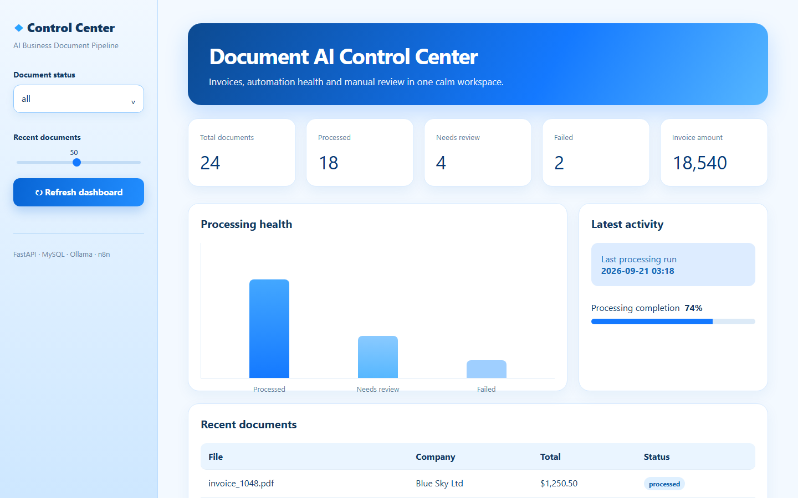
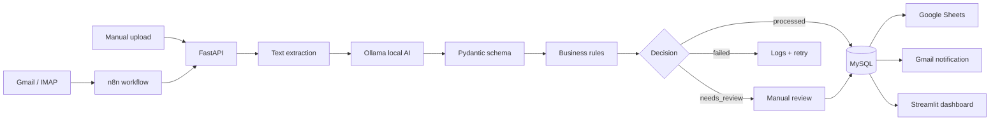
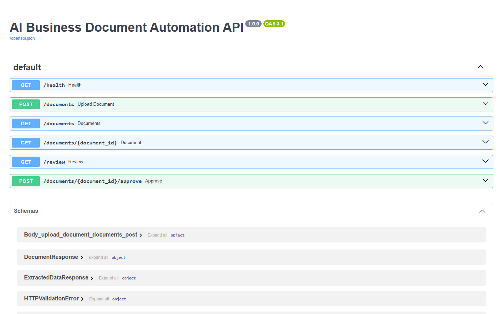

# AI Business Document & Email Automation Pipeline


Production-style workflow for receiving business documents from email or an
API, extracting structured invoice data with local AI, validating it, storing
it in MySQL, and routing the result to Google Sheets, notifications, and manual
review.

The AI model runs locally through Ollama, so the core workflow does not require
a paid API key.



## What it demonstrates

- PDF, DOCX, and TXT document intake
- Gmail/IMAP attachment ingestion
- Local AI classification and structured extraction with Ollama
- Strict Pydantic schemas and deterministic business rules
- `processed`, `needs_review`, and `failed` decision routing
- File-hash and invoice-identity duplicate protection
- MySQL persistence and processing history
- Google Sheets synchronization and Gmail notifications
- FastAPI endpoints for uploads, queries, review, and approval
- n8n orchestration without moving core business logic out of Python
- Streamlit operations dashboard and manual-review queue
- Docker Compose deployment with health checks and persistent volumes
- Rotating logs, retries, batch isolation, and 70 automated tests

## Architecture



## Dashboard

The blue operations dashboard displays totals, processing health, invoice
amounts, recent documents, and the manual-review queue. Review items can be
approved directly from the interface.

Open it at [http://localhost:8501](http://localhost:8501) after starting Docker.

## API



| Method | Endpoint | Purpose |
|---|---|---|
| `GET` | `/health` | Container and API health check |
| `POST` | `/documents` | Upload and process a document |
| `GET` | `/documents` | List processed documents |
| `GET` | `/documents/{id}` | Retrieve one document |
| `GET` | `/review` | List documents requiring review |
| `POST` | `/documents/{id}/approve` | Approve a reviewed document |

Interactive documentation: [http://localhost:8016/docs](http://localhost:8016/docs)

## Quick start with Docker

### 1. Install prerequisites

- Docker Desktop
- [Ollama](https://ollama.com/download/windows)
- Git

Download the free local model:

```bash
ollama pull qwen2.5:3b
```

### 2. Configure the project

Copy `.env.example` to `.env` and `.env.docker.example` to `.env.docker`.
Replace the placeholder database passwords in `.env.docker`.

The minimum local AI configuration is:

```env
OLLAMA_HOST=http://localhost:11434
OLLAMA_MODEL=qwen2.5:3b
```

Gmail and Google Sheets settings are optional. Never commit `.env`, app
passwords, or service-account JSON files.

### 3. Start the stack

```bash
docker compose --env-file .env.docker up --build -d
docker compose --env-file .env.docker ps
```

| Service | URL / port |
|---|---|
| Dashboard | http://localhost:8501 |
| FastAPI docs | http://localhost:8016/docs |
| n8n | http://localhost:5678 |
| MySQL | localhost:3307 |

MySQL uses host port `3307` to avoid conflicting with a local MySQL installation
on port `3306`.

## Final end-to-end demo

Run the successful invoice scenario:

```powershell
.\.venv\Scripts\python.exe -m scripts.demo_workflow
```

The demo verifies API health, uploads an invoice, runs extraction and
validation, saves the result, and uploads the same file again to prove duplicate
detection.

Run the manual-review scenario:

```powershell
.\.venv\Scripts\python.exe -m scripts.demo_workflow `
  --file demo/invoice_needs_review.txt `
  --skip-duplicate-check
```

The second example intentionally omits an invoice number and uses an invalid
total. It is routed to the dashboard review queue.

## Run without Docker

```bash
python -m venv .venv
python -m pip install -r requirements.txt
python -m app.main path/to/invoice.pdf
```

Batch-process a directory:

```bash
python -m app.main path/to/documents/
```

Read new supported attachments from the configured inbox:

```bash
python -m app.main --email
```

Start the API and dashboard separately:

```bash
uvicorn app.api:create_app --factory --host 0.0.0.0 --port 8000
streamlit run app/dashboard.py
```

## Validation and review rules

After AI extraction, every invoice passes through:

1. Pydantic type and schema validation.
2. Required-field checks.
3. Positive amount and supported-currency checks.
4. Email and date validation.
5. Subtotal + tax = total verification.
6. Confidence and uncertain-field assessment.

Missing or suspicious business data produces `needs_review`. Technical errors
produce `failed`. One bad document never stops the remaining batch.

## Integrations

### Gmail

Configure `IMAP_*` values for attachment ingestion and `SMTP_*` values for
notifications. Use a Gmail app password, not the normal account password.

### Google Sheets

Enable the Google Sheets API, create a service account, place its ignored JSON
key under `credentials/`, share the spreadsheet with the service-account email,
and configure the `GOOGLE_SHEETS_*` variables.

### n8n

Import `n8n/workflows/email-document-pipeline.json`. The workflow receives
email attachments and sends them to FastAPI. Keep classification, validation,
and persistence in Python.

## Project structure

```text
app/                 Core pipeline, API, integrations, and dashboard
demo/                Safe demonstration invoices
docs/screenshots/    Portfolio screenshots
n8n/workflows/       Importable automation workflow
scripts/             End-to-end demo runner
tests/               Automated test suite
Dockerfile
docker-compose.yml
requirements.txt
```

## Tests

```bash
python -m unittest discover -v
```

Current result: **70 tests passing**.

## Security notes

- Secrets are loaded only from ignored environment files.
- Uploaded API files are size-limited and removed after processing.
- Credential JSON files are excluded from Git.
- AI processing can remain fully local with Ollama.
- Docker services use health checks and persistent named volumes.

## Portfolio summary

This repository demonstrates a complete AI-powered document-processing system,
not only a PDF-to-JSON prototype: ingestion, local AI, schema validation,
business controls, persistence, automation, human review, observability, APIs,
and containerized deployment are all included.
